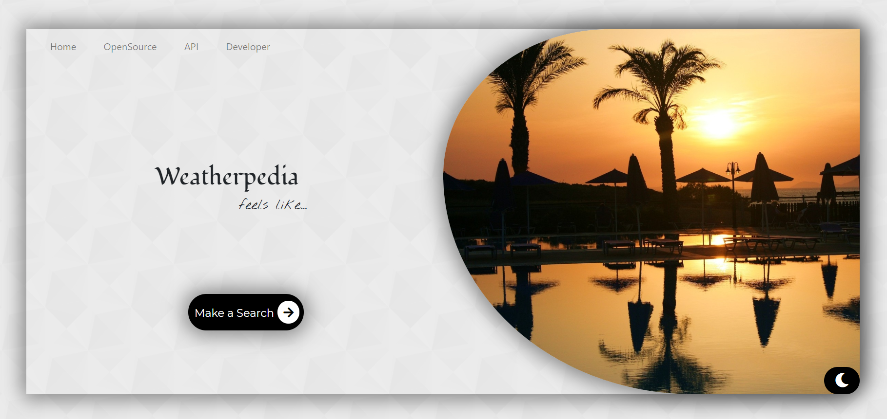

# [Weatherpedia ⛅](https://github.com/SandeepKrSuman/weatherpedia)



<br>

## Tech Stack 📚
- Built on [ReactJS](https://reactjs.org/) using [create-react-app](https://github.com/facebook/create-react-app) .
<p align="center">
     
     
     
     
     
</p>

<br>

## Demo 🎥


<br>

## Project Structure 🔌
```
Weatherpedia
|
|__________public                 # contains static files
|          |
|          |_____index.html       # contains root div, meta tags, style links, cdn's, etc.
|          |
|          |_____style.css        # contains all the css styles used any where in the project
|          |
|          *Other static files*
|
|
|__________src                    # contains source files / components
|          |
|          |_____App.js           # handles react router and routes
|          |
|          |_____HomePage.js      # homepage component, handles theme and theme change on homepage
|          |
|          |_____Index.js         # react-dom, renders App component to root div in index.html
|          |
|          |_____Navbar.js        # Navbar component
|          |
|          |_____Navigate.js      # contains navigate button which on click changes the route to "/weather"
|          |
|          |_____SearchBar.js     # SearchBar component, form with a input field to accept a city name
|          |
|          |_____Title.js         # for displaying titles and/or temperature, city name & country code
|          |
|          |_____Weather.js       # handles major functions of the app - api fetching and displaying the weather data
|          |
|          |_____WeatherCard.js   # generates a card for different values of weather data passed as props from Weather.js
|
|
|__________.env                   # for storing environment variables
|
|__________.gitignore             # specifies intentionally untracked files that Git should ignore
|
|__________README.md              # github readme file
|
|
*other project files* 

```

<br>

<h2 align="center">Setup 🛠</h2>

### Prerequisites :

- ```npm``` is required for installing dependencies. ```npm``` usually comes blundled with ```node```.
  
  Install [Node](https://nodejs.org/), if it is not installed already.
  
  To check whether node is present or not, go to your command line / terminal and type in ```node --version``` .  
If a version shows up, means node is installed. If not, install the LTS version of [Node](https://nodejs.org/). Check for [npm](https://www.npmjs.com/get-npm) using ```npm --version```.

- install [git](https://git-scm.com/downloads) for version control and for cloning the repository. Verify using ```git --version```.
- This app takes weather data from [OpenWeather](https://openweathermap.org/). Which requires an API key. Sign up and generate your own **free** [API](https://openweathermap.org/api) key which will be required during installation process.

### Installation :
  
  >
  > Step 1: Fork [this repo](https://github.com/SandeepKrSuman/weatherpedia)
  > 
  > Step 2: Clone your forked version of this repo locally. To clone, go to your command line / terminal, cd over to an appropriate directory and type in ```git clone https://github.com/<your username>/weatherpedia.git```
  > 
  > Step 3: ```cd weatherpedia```
  > 
  > Step 4: Open the project in your favourite text editor
  > 
  > Step 5: Go to ```.env``` file and type in ```REACT_APP_API_URL=https://api.openweathermap.org/data/2.5/weather?appid=<YOUR API KEY HERE>&units=metric&q=```. Strictly maintian the structure of the url. (Also note that  environment variables in React should start with ```REACT_APP_```)
  > 
  > Step 6: On the command line / terminal type in ```npm install``` to install dependencies
  > 
  > Step 7: Finally run the app using ```npm start```
  > 
  >  The server will start on port `3000` which can be accessed through <http://localhost:3000/> .
  >  

<br>

## API 📊
This React app fetches current weather data from [OpenWeather](https://openweathermap.org/) using [OpenWeatherMap API](https://openweathermap.org/api).

<br>
     
## Developer 😎
Made with ❤ by [SandeepKrSuman](https://github.com/SandeepKrSuman).

  <br><br>
