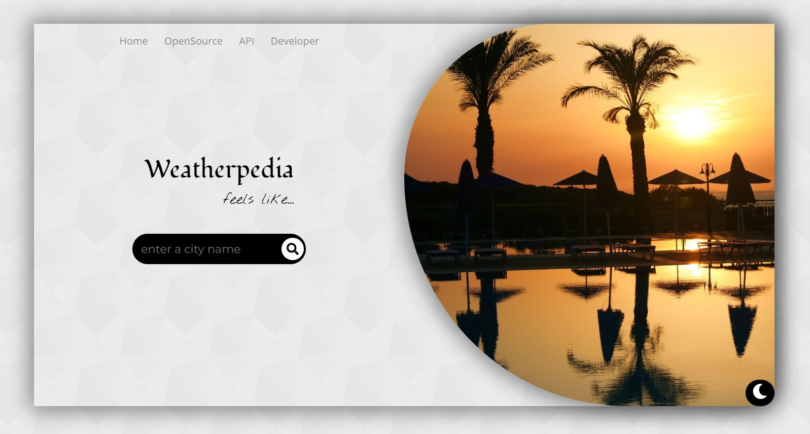
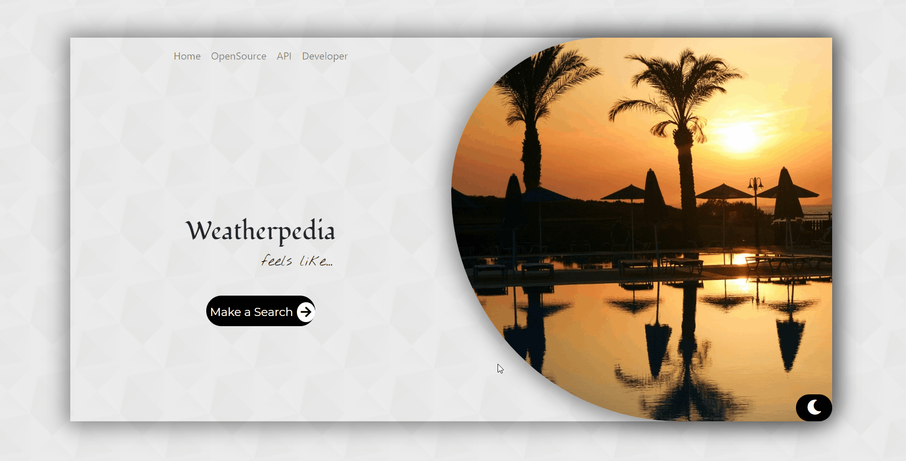

# [Weatherpedia](https://github.com/SandeepKrSuman/weatherpedia) ⛅

 

## Tech Stack 📚

- Built on [ReactJS](https://reactjs.org/) using [create-react-app](https://github.com/facebook/create-react-app) .

     
     
     
     
     

 

## Demo 🎥

 

<h2 align="center">Setup 🛠</h2>

### Prerequisites :

- `npm` is required for installing dependencies. `npm` usually comes blundled with `node`.

  Install [Node](https://nodejs.org/), if it is not installed already.

  To check whether node is present or not, go to your command line / terminal and type in `node --version` .  
  If a version shows up, means node is installed. If not, install the LTS version of [Node](https://nodejs.org/). Check for [npm](https://www.npmjs.com/get-npm) using `npm --version`.

- install [git](https://git-scm.com/downloads) for version control and for cloning the repository. Verify using `git --version`.
- This app takes weather data from [OpenWeather](https://openweathermap.org/). Which requires an API key. Sign up and generate your own **free** [API](https://openweathermap.org/api) key which will be required during installation process.

### Installation :

> Step 1: Fork [this repo](https://github.com/SandeepKrSuman/weatherpedia)
>
> Step 2: Clone your forked version of this repo locally. To clone, go to your command line / terminal, cd over to an appropriate directory and type in `git clone https://github.com/<your username>/weatherpedia.git`
>
> Step 3: `cd weatherpedia`
>
> Step 4: Open the project in your favourite text editor
>
> Step 5: Create a `.env` file in the root of the project and store your API key. Take a look at `.env.example` file for reference. Put your `API Key` in place of `<YOUR API KEY HERE>` and save the `.env` file. (Also note that environment variables in React should start with `REACT_APP_`)
>
> Step 6: On the command line / terminal type in `npm install` to install dependencies
>
> Step 7: Finally run the app using `npm start`
>
> The server will start on port `3000` which can be accessed through <http://localhost:3000/> .

 

## API 📊

This React app fetches current weather data from [OpenWeather](https://openweathermap.org/) using [OpenWeatherMap API](https://openweathermap.org/api).

 
     
## Developer 😎

Made with ❤ by [SandeepKrSuman](https://github.com/SandeepKrSuman).

  

### Credits for using the pictures

The pictures used in this app are royalty free pictures. Proper credits are given to the creators below.

 

Shout-out to these amazing people :

| Pictures used in the app                                                                   | Credits                                                                  |
| ------------------------------------------------------------------------------------------ | ------------------------------------------------------------------------ |
| [homepage-day](https://www.freeimages.com/photo/sunset-1364946)                            | [ela23](https://www.freeimages.com/photographer/ela23-50489)             |
| [homepage-night](https://www.freeimages.com/photo/full-moon-rising-over-tree-tops-1312287) | [Alexei Novikov](https://www.freeimages.com/photographer/nolexa-54340)   |
| [snow](https://unsplash.com/photos/_TuI8tZHlk4)                                            | [Josh Hild](https://unsplash.com/@joshhild)                              |
| [clear-day](https://www.freeimages.com/photo/sun-blast-1538370)                            | [Matthew Bowden](https://www.freeimages.com/photographer/thesaint-30769) |
| [drizzle](https://unsplash.com/photos/rWwj4zcOcIs)                                         | [Philippe Tarbouriech](https://unsplash.com/@phitar)                     |
| [rain](https://unsplash.com/photos/00yDgACVeMA)                                            | [Jack Finnigan](https://unsplash.com/@jackofallstreets)                  |
| [thunderstorm](https://unsplash.com/photos/jSADgWPmKDU)                                    | [Michael D](https://unsplash.com/@alienaperture)                         |
| [haze](https://www.freeimages.com/photo/bridge-in-the-haze-1455835)                        | [Luca Cinacchio](https://www.freeimages.com/photographer/cinacchi-30870) |
| [fog](https://unsplash.com/photos/OdBFUurPHjo)                                             | [Sebin Thomas](https://unsplash.com/@sebinthomas)                        |
| [squall](https://unsplash.com/photos/nmv3h1QP1ic)                                          | [Andrea Fabry](https://unsplash.com/@akfabry)                            |
| [tornado](https://www.pexels.com/photo/lightning-and-tornado-hitting-village-1446076/)     | [Ralph W. lambrecht](https://www.pexels.com/@ralph-w-lambrecht-642090)   |
| [partly-cloudy](https://unsplash.com/photos/04zTvMalMfU)                                   | [Adriel Kloppenburg](https://unsplash.com/@adriel)                       |
| [overcast](https://unsplash.com/photos/IghZxJgO94M)                                        | [Nathan Anderson](https://unsplash.com/@nathananderson)                  |
| [default-background](https://pixabay.com/photos/wood-boards-texture-wooden-brown-1846972/) | [Pexels](https://pixabay.com/users/pexels-2286921/)                      |
| [volcanic-ash](https://pixabay.com/photos/tongariro-new-zealand-volcanoes-6286058/)        | [jawajeziorski](https://pixabay.com/users/jawajeziorski-21806402/)       |
| [clear-night](https://unsplash.com/photos/bXk3Qn6HXk8)                                     | [Raimond Klavins](https://unsplash.com/@raimondklavins)                  |
